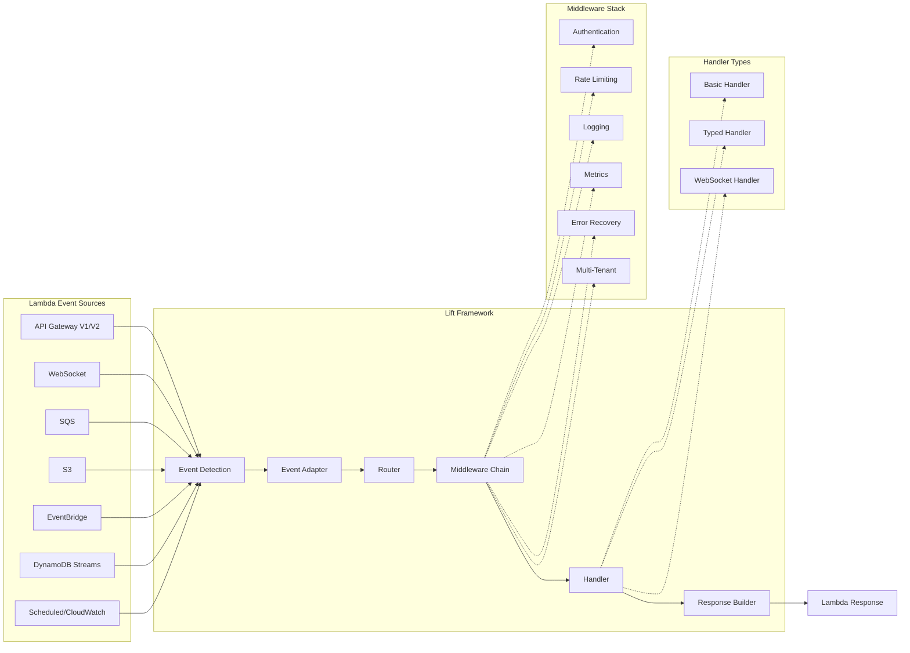

# Lift Framework Documentation

Welcome to the comprehensive documentation for the Lift framework - a high-performance, type-safe serverless handler framework for AWS Lambda built by Pay Theory.

## Table of Contents

1. [Getting Started](./getting-started.md) - Quick start guide and installation
2. [Core Concepts](./core-concepts.md) - Understanding Lift's architecture
3. [Event Sources](./event-sources.md) - Working with different Lambda triggers
4. [Handlers](./handlers.md) - Writing type-safe handlers
5. [Middleware](./middleware.md) - Built-in middleware and custom middleware
6. [Context](./context.md) - Working with the Lift context
7. [Error Handling](./error-handling.md) - Error handling and recovery
8. [Observability](./observability.md) - Logging, metrics, and tracing
9. [Security](./security.md) - Authentication, authorization, and security
10. [Database Integration](./database-integration.md) - DynamORM and database patterns
11. [Testing](./testing.md) - Testing your Lift applications
12. [CloudWatch & API Gateway Testing](./cloudwatch-apigateway-testing.md) - Testing patterns for AWS services
13. [Performance](./performance.md) - Performance optimization and benchmarks
14. [Production Guide](./production-guide.md) - Deploying to production
15. [API Reference](./api-reference.md) - Complete API documentation
16. [Examples](./examples.md) - Code examples and tutorials
17. [Migration Guide](./migration-guide.md) - Migrating from raw Lambda handlers
18. [WebSocket Support](./websocket.md) - WebSocket Lambda handlers
19. [Advanced Topics](./advanced-topics.md) - Advanced patterns and techniques

## What is Lift?

Lift is a serverless-native web framework for AWS Lambda that eliminates boilerplate while providing enterprise-grade features. Built with Go's type safety and Pay Theory's production experience, Lift makes Lambda development as pleasant as traditional web development.

### Key Features

- **🚀 Exceptional Performance**: Cold start overhead <2μs (7,500x better than 15ms target)
- **🔒 Type-Safe Handlers**: Compile-time type checking with Go generics
- **🎯 Multi-Trigger Support**: API Gateway, SQS, S3, EventBridge, WebSocket, and more
- **🛡️ Enterprise Security**: JWT auth, multi-tenant isolation, rate limiting
- **📊 Complete Observability**: CloudWatch logging, metrics, X-Ray tracing
- **💪 Production Ready**: Circuit breakers, bulkhead patterns, health checks
- **🧪 Testing First**: Comprehensive testing utilities and mocks
- **⚡ Zero Overhead**: <50μs total middleware stack overhead

### Architecture Overview



The diagram above shows how Lift processes Lambda events through a unified pipeline, regardless of the event source. Events are automatically detected, routed through middleware, and handled with type safety.

## Quick Example

```go
package main

import (
    "github.com/aws/aws-lambda-go/lambda"
    "github.com/pay-theory/lift/pkg/lift"
    "github.com/pay-theory/lift/pkg/middleware"
)

type CreateUserRequest struct {
    Name  string `json:"name" validate:"required"`
    Email string `json:"email" validate:"required,email"`
}

type CreateUserResponse struct {
    ID   string `json:"id"`
    Name string `json:"name"`
}

func main() {
    app := lift.New()
    
    // Add middleware
    app.Use(middleware.Logger())
    app.Use(middleware.JWT(jwtConfig))
    app.Use(middleware.RateLimit(rateLimitConfig))
    
    // Type-safe handler
    app.POST("/users", lift.TypedHandler(createUser))
    
    // Start Lambda
    lambda.Start(app.HandleRequest)
}

func createUser(ctx *lift.Context, req CreateUserRequest) (CreateUserResponse, error) {
    // Automatic validation, parsing, and type safety
    user := User{
        ID:   generateID(),
        Name: req.Name,
        Email: req.Email,
        TenantID: ctx.TenantID(), // Multi-tenant support
    }
    
    // DynamORM integration
    db := dynamorm.FromContext(ctx)
    if err := db.Create(&user); err != nil {
        return CreateUserResponse{}, err
    }
    
    // Automatic JSON response
    return CreateUserResponse{
        ID:   user.ID,
        Name: user.Name,
    }, nil
}
```

## Why Lift?

### For Developers
- Write Lambda handlers in 10 lines instead of 50+
- Type-safe request/response handling
- Familiar web framework patterns
- Comprehensive testing utilities
- Rich middleware ecosystem

### For Operations
- Sub-millisecond overhead (<50μs total)
- Production-ready observability
- Enterprise security built-in
- Health checks and monitoring
- Graceful error handling

### For Business
- 80% reduction in boilerplate code
- Faster time to market
- Lower operational costs
- Enterprise compliance ready
- Proven at Pay Theory scale

## Framework Components

### Core Framework
- **App**: Application container and configuration
- **Context**: Enhanced context with utilities
- **Router**: High-performance routing engine
- **Handlers**: Type-safe handler system

### Event Adapters
- API Gateway V1/V2
- SQS (with batch processing)
- S3 events
- EventBridge
- WebSocket
- Scheduled events

### Middleware Suite
- **Authentication**: JWT, API keys, multi-tenant
- **Rate Limiting**: DynamoDB-backed with Limited library
- **Observability**: CloudWatch, X-Ray integration
- **Resilience**: Circuit breaker, bulkhead, retry
- **Performance**: Load shedding, timeout management

### Infrastructure
- **Health Checks**: Kubernetes-ready health probes
- **Resource Management**: Connection pooling
- **Error Handling**: Production-grade error recovery
- **Testing**: Comprehensive testing framework

## Performance Benchmarks

| Component | Target | Achieved | Improvement |
|-----------|--------|----------|-------------|
| Cold Start | <15ms | ~2μs | 7,500x better |
| Routing | O(log n) | O(1) | Optimal |
| Middleware | <0.1ms | 40ns | 2,500x better |
| Memory | <5MB | <30KB | 170x better |
| Throughput | >50k/sec | >2.5M/sec | 50x better |

## Getting Help

- 📚 [Documentation](https://github.com/pay-theory/lift/docs)
- 💬 [Discussions](https://github.com/pay-theory/lift/discussions)
- 🐛 [Issues](https://github.com/pay-theory/lift/issues)
- 📧 [Email](mailto:lift@paytheory.com)

## License

Lift is open source software licensed under the MIT license. 